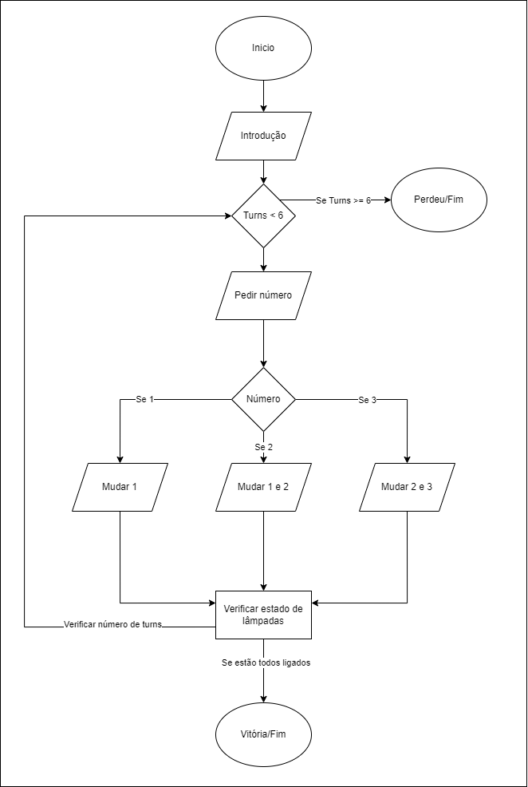

# Puzzle das Lâmpadas
## Projeto 1 - Grupo 2 - https://github.com/JoaoSaMarques/Projeto1-Grupo2

O conceito do trabalho é fazer um Jogo onde existe três lâmpadas e três butões. O utilizador deve ligar todas as lâmpadas, no mínimo de turnos.

## Autores
__________________________________________________________
Trabalho feito para LP1 por:
  * João Sá Marques (22209640)
    * Criação do Repositório;
    * Criação do Markdown;
    * Implementação do "Código Base" para ínicio de Projeto;
    * Alteração do Estado das Lâmpadas;
    * Implementação das condições de Vitória e Perda;
    * Contabilização dos Turnos Realizados.
    * Fluxograma
    
  * Guilherme Negrinho (22207383)
    * Criação da Introdução de Jogo;
    * Aperfeiçoamento das condições de Vitória e Perda;
    * Limpeza do Código;
    * Polimento do Design;
    * Auxílio no Fluxograma;
    * Acabamento do Markdown.
__________________________________________________________
#### *Erros encontrados e desafios*
>Tivemos difficuldades com o LampState e como organizar o código para que funcionasse corretamente.

__________________________________________________________
## Arquitetura de Solução

1. Explicação ao Jogador
	- Introdução ao Jogador;
	- Consentimento para Prosseguir.

2. Inicialização do Jogo
	* Implementação das Lampadas
		- Enumeração Pública (On, OFF);
		- Lista com as 3 Lâmpadas;
		- Alteração do seu estado.
	
	* Solicitação do Input do Jogador;
		- Altera o Output Consoante o Input;
		- Alteração do Estado das Lampadas para On and Off;
		- Apresentação do Output;
		- Contabilização dos Turnos Realizados.
		
	* Condições de Vítoria e Perda
		- Caso o Jogador ganhe antes ou até 6 rondas, condição de vitória;
		- Caso o Jogador não conseguir ter todas as Lampadas ligada até 6 rondas, condições de Perda;
		- Se ainda não tiver alcançado nenhuma desta condições, o Loop do Jogo prossegue.

__________________________________________________________

## Fluxograma

__________________________________________________________
## Referências

* Ana Pinha
	- Discussão de possíveis metódos para alteração do estado da Lâmpada.

* Booleans
	- https://www.w3schools.com/cs/cs_booleans.php

* Enumerações com Switch
	- https://www.w3schools.com/cs/cs_enums.php
